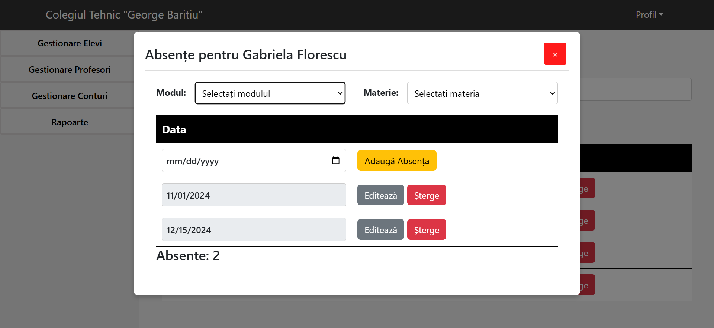
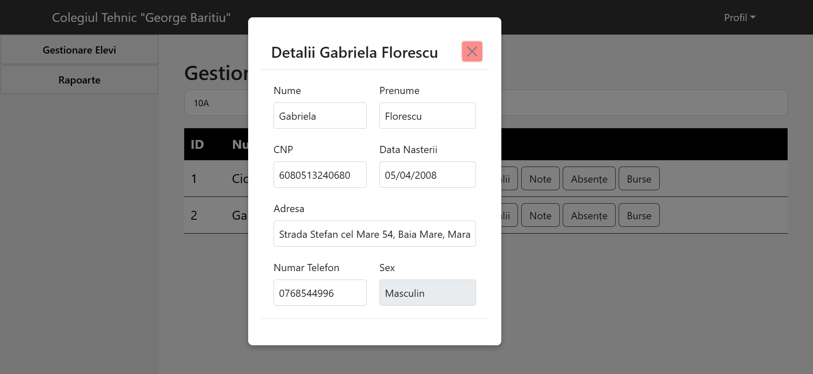

# Sistem Evidenta Elevi

## Versiuni

Pentru a rula acest proiect, asigurați-vă că aveți următoarele versiuni instalate:

- **IntelliJ IDEA Ultimate**
- **Maven**
- **JDK 17**
- **Node.js v20.0.8** (folosit pentru React cu Vite)
- **MySQL v8.0.36**

## Configurare băza de date

1. **Instalați MySQL** (dacă nu este deja instalat).
2. **Creați o bază de date numită `liceuu`:** 
   **```CREATE DATABASE liceuu;```**
3. Modificați fișierul de configurare (**application.properties** în **backend/src/main/resources**) pentru a seta numele de utilizator și parola pentru baza de date, 
dacă nu le folosiți pe cele care sunt deja:

   ```
   spring.datasource.url=jdbc:mysql://localhost:3306/liceuu
   spring.datasource.username=USERNAMEUL_DUMNEAVOASTRA_AICI
   spring.datasource.password=PAROLA_DUMNEAVOASTRA_AICI
   ```
## Pași de instalare

1. **Clonați repository-ul:** 
   - **```git clone git@github.com:ruben-23/sistem-evidenta-elevi.git```**
2. **Configurați structura proiectului în IntelliJ IDEA:**
   - Mergeți la **backend/src/main/java**, faceți click dreapta pe folderul java și selectați **Mark Directory as > Sources Root**.
   - Mergeți la **backend/src/main/resources**, faceți click dreapta pe folderul resources și selectați **Mark Directory as > Resources Root**.
   - Mergeți la **backend/src/test**, faceți click dreapta pe folderul test și selectați **Mark Directory as > Test Sources Root**.
3. **Instalați dependențele pentru frontend:**
   - Mergeți la **Frontend/SistemEvidentaEleviReact** și rulați comanda: **```npm install```**
4. **Rulați aplicația:**
   - În **IntelliJ IDEA**, faceți clic pe fișierul **SistemDeEvidentaAElevilorApplication** și apoi apăsați butonul Run.
   - După ce aplicația backend este pornită, navigați la **Frontend/SistemEvidentaEleviReact** și rulați comanda: ```npm run dev```
   - Asigurați-vă că aplicația frontend rulează pe portul **5173** și aplicația backend pe portul **8080**.
     
Acum ar trebui să aveți aplicația funcțională atât pe backend, cât și pe frontend. Dacă întâmpinați probleme, verificați
configurațiile și asigurați-vă că toate dependențele sunt instalate corect.

## Conturi de utilizator

Pentru a accesa aplicația, aveți nevoie de conturi de utilizator pentru fiecare rol. Mai jos aveți detaliile conturilor:

**Rol Administrator:**

**Nume Utilizator:** `vasilescuioana`  
**Parola:** `ioana`

**Rol Profesor:**

**Nume Utilizator:** `ionpopescu`  
**Parola:** `ionpopescu`

**Nume Utilizator:** `sebastiansava`  
**Parola:** `sebastiansava`


## Capturi de ecran

### Secretara

**Pagina Principala - Gestionare Elevi**


**Adaugare Elev**


**Detalii Elev**


**Note**


**Absente**


**Gestionare Profesori**


**Gestionare Conturi**


### Profesor

**Pagina Principala - Gestionare Elevi**


**Detalii Elev**


**Note**


**Absente**

